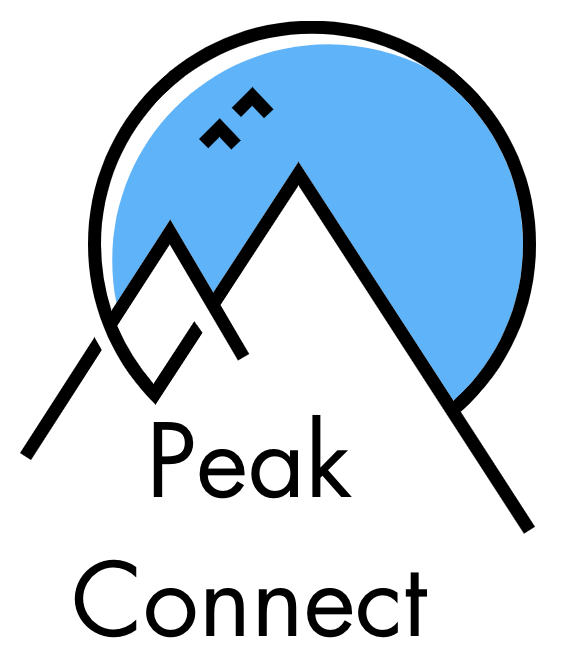

# Social Media Project Frontend ❤️

Welcome to PeakConnect, a mountainers-inspired social media project, designed and developed with versatility and robust functionality in mind. 



<hr>

<summary> Table of contents 📝</summary> 
    <ol> 
    <li><a href="#about-the-project-📁">About the project</a></li> 
    <li><a href="#deploy-🚀">Deploy</a></li> 
    <li><a href="#stack">Stack</a></li> 
    <li><a href="#local-installation-option">Clone</a></li> 
    <li><a href="#features-⚒">Features</a></li> 
    <li><a href="#future-improvements">Future Improvements</a></li> 
    <li><a href="#contributions">Contribution</a></li> 
    <li><a href="#development">Development</a></li>    
    <li><a href="#appreciations">Appreciation</a></li> 
    <li><a href="#contact">Contact</a></li>
    </ol>

<hr>

## About the project

The main idea for the project was recreating a social media for people that love meeting other people and go on mountain adventures with them. Constructed with the use of non-relational database technology (MongoDB in conjunction with the Mongoose library), this web page gives birth to a social media application where users can engage, share, and interact through texts and image posts. It has the same functions as most famous social medias but this specific one is created only for the people in the mountains. Hope you like it!


## Deploy 🚀

<div align="center">
    <a href="https://social-media-app.zeabur.app"><strong> github.io/peak-connect </strong></a>🚀🚀🚀
</div>

## Stack

Used technologies for the project:

<div align="center"> 
<a href="https://reactjs.org/"> 
 
</a> 
<a href="https://www.typescriptlang.org/"> 

 </a>
 <a href="https://sass-lang.com/"> 
  
 </a> 
 <a href="https://axios-http.com/"> 
  
 </a> 
  <a href="https://materialui.com/"> 
  
 </a> 
   <a href="https://reactrouter.com/"> 
  
 </a> 
   <a href="https://node.com/"> 
  
 </a> 
    <a href="https://npm.com/"> 
  
 </a>
     <a href="https://redux.com/"> 
  
 </a>
      <a href="https://jwtdecoded.com/"> 
  
 </a>
 </div>


## Features ⚒

#### User Authentication:

- Register new users.
- Login with email and password.

#### Posts Managment:

- Create, update, delete new post.
- Search for a specific post or user via the search bar.

#### Admin Dashboard:

- Browse users and manage them if wanted.
- Select posts, delete posts and continuous development.
- Graphs in development for statistics.

#### Interactive UI:

- Responsive design ensuring compatibility across various devices and screen sizes.
- Dashboard for Admins/Super Admins:
  Manage posts, users, and user roles.


## Local installation option ⚙️

1. Clone the repository from the URL:
   `git clone https://github.com/yoanastamenova/Social_media--front.git`
2. Go into the cloned repostiory
   ` cd tattoo-studio-front`
3. Install npm packages:
   `npm install `
4. From the REST API project clone it as well from this link:
   `git clone https://github.com/yoanastamenova/Social_media--back.git`

    Start the REST API server: 
   `npm run dev` 
   wait for "Server is running on port: 2132" message in the terminal

- If you dont have Mongo installed locally you can check the documentation of the REST API for a docker command to obtain it

5. Start the React project
   `npm start `
   Open http://localhost:3000(or whatever path it was given) to view the project web page view in the browser.

## Views

<div align="center"> 
   
   
   
</div>


## Future functionalities

✅ Add timeline option 

⬜ Add user biometrics

⬜ Include profile privacy options

## Contribute to the project

Feel free to suggest an improvment or functionality to my project.

There are two ways of doing this:

1. Opening an issue
2. Creating a fork of the repository
   - Creating a new branch
     ```
     $ git checkout -b feature/yourUsername -feat
     ```
   - Make a commit with your changes
     ```
     $ git commit -m 'feat: this X thing'
     ```
   - Make a push to the branch
     ```
     $ git push origin feature/yourUsername -feat
     ```
   - Opening a Pull Request

## Development:

```js
const developer = "yoanastamenova";

console.log("Developed by: " + developer);
```

## Appreciations:

Forever gratefull to GeeksHubs Academy for the oportunety to learn and grow on my career path. <3

## Contact

<a href = "mailto:micorreoelectronico@gmail.com"></a>
<a href="https://www.linkedin.com/in/linkedinUser/" target="_blank"></a>

</p>
